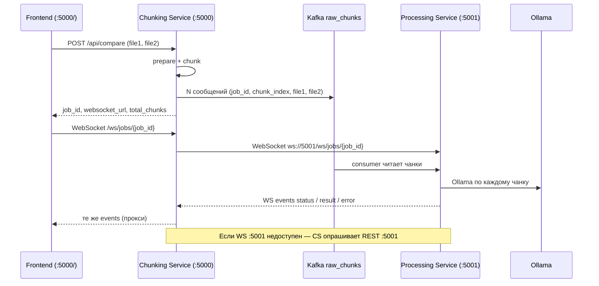

# Как Chunking Service получает и отдаёт ответы

Документ описывает **только сервис на порту 5000** (Chunking & Producer + WebSocket Gateway)  
и его связь с фронтендом и Processing Service (:5001).

---

## Роль сервиса

| Что делает | Что **не** делает |
|------------|-------------------|
| Принимает PDF/DOCX от фронтенда | Не вызывает Ollama |
| Режет на чанки (txt / img) | Не агрегирует финальный JSON сравнения |
| Публикует чанки в Kafka `raw_chunks` | Не читает `processed_results` |
| Отдаёт `job_id` и URL WebSocket | Не хранит состояние задачи после Kafka |
| **Проксирует** прогресс и результат с :5001 на фронт | |

Ollama, consumer Kafka и сборка результата — **Processing Service (:5001)**.

---

## Общая схема



---

## Шаг 1. Загрузка файлов — `POST /api/compare`

**Кто вызывает:** фронтенд (`frontend/index.html`).

**Ответ при успехе (HTTP 200):**

```json
{
  "job_id": "550e8400-e29b-41d4-a716-446655440000",
  "status": "queued",
  "total_chunks": 5,
  "kafka_topic": "raw_chunks",
  "websocket_url": "ws://localhost:5000/ws/jobs/550e8400-e29b-41d4-a716-446655440000",
  "file1": { "filename": "a.pdf", "format": "pdf", "chunks": 3 },
  "file2": { "filename": "b.docx", "format": "docx", "chunks": 2 }
}
```

**Важно:**

- `status: "queued"` — задача **только поставлена в Kafka**. Это не прогресс Ollama.
- `total_chunks` — число сообщений в `raw_chunks` (пар file1+file2 по `chunk_index`).
- После этого ответа Chunking Service **больше сам ничего не инициирует** — ждёт события от Processing.

**Что уходит в Kafka** (каждое сообщение):

```json
{
  "job_id": "...",
  "document_id": "...",
  "chunk_index": 1,
  "total_chunks": 5,
  "file1": { "filename": "...", "format": "pdf", "content_type": "image", "content": "<base64 PNG>" },
  "file2": { "filename": "...", "format": "docx", "content_type": "text", "content": "..." }
}
```

---

## Шаг 2. WebSocket — прогресс и результат

**Кто вызывает:** фронтенд сразу после `POST /api/compare`.

**URL:** значение `websocket_url` из ответа, обычно:

```
ws://localhost:5000/ws/jobs/{job_id}
```

**Не подключайтесь напрямую к :5001**, если используете встроенный фронт — он ждёт gateway на :5000.

### Что делает Chunking Service внутри

1. Принимает WebSocket от фронтенда (`/ws/jobs/{job_id}`).
2. Открывает **исходящий** WebSocket к Processing Service:  
   `ws://localhost:5001/ws/jobs/{job_id}` (настраивается через `PROCESSING_SERVICE_URL`).
3. **Прозрачно пересылает** все текстовые сообщения Processing → Frontend.
4. Ping от фронта (`"ping"`) тоже пересылается на :5001.

### Fallback (если WS :5001 недоступен)

Chunking Service переключается на **REST polling** каждые `PROCESSING_POLL_INTERVAL_SEC` (по умолчанию 2 с):

| Запрос | Назначение |
|--------|------------|
| `GET http://localhost:5001/api/jobs/{job_id}` | статус и `processed_chunks` |
| `GET http://localhost:5001/api/jobs/{job_id}/result` | финальный JSON (когда `status == "completed"`) |

Ответы REST **оборачиваются** в тот же формат WebSocket-событий (см. ниже) и отправляются на фронт.

---

## Формат сообщений WebSocket (контракт для фронта)

Фронтенд (`frontend/index.html`) понимает **только JSON** такого вида:

### Прогресс — `type: "status"`

```json
{
  "type": "status",
  "job_id": "550e8400-e29b-41d4-a716-446655440000",
  "data": {
    "job_id": "...",
    "document_id": "...",
    "status": "processing",
    "processed_chunks": 3,
    "total_chunks": 5,
    "message": "Анализ chunk 3/5..."
  }
}
```

**На экране:** `[status] 3/5 — Анализ chunk 3/5...`

Обязательные поля для отображения счётчика: **`data.processed_chunks`** и **`data.total_chunks`**.

### Результат — `type: "result"`

```json
{
  "type": "result",
  "job_id": "550e8400-e29b-41d4-a716-446655440000",
  "data": {
    "comparison": {
      "identical": false,
      "differences": [
        {
          "line_number": 1,
          "file1_line": "...",
          "file2_line": "..."
        }
      ]
    }
  }
}
```

**На экране:** `[result] Сравнение завершено` + JSON `msg.data`.

Фронт **не парсит** `comparison` отдельно — просто выводит `msg.data` целиком.

### Ошибка — `type: "error"`

```json
{
  "type": "error",
  "job_id": "...",
  "data": {
    "message": "Текст ошибки",
    "details": {}
  }
}
```

### Что фронт **не** обрабатывает

- Плоский JSON без полей `type` / `job_id` / `data` — попадёт в лог как сырой текст, **без счётчика чанков**.
- `type` отличный от `status` | `result` | `error` — тоже сырой вывод.

---

## Шаг 3. REST endpoints этого сервиса (не для live-прогресса)

| Endpoint | Назначение |
|----------|------------|
| `GET /health` | Kafka producer + доступность Processing (`GET :5001/health`) |
| `POST /api/result` | Разбор сырого ответа Ollama (`body.ollama`) — **legacy**, live-поток через WS |

---

## Где «живёт» состояние задачи

| Данные | Где |
|--------|-----|
| Чанки в очереди | Kafka `raw_chunks` |
| Сколько чанков обработано | **Processing Service** (память + Kafka `status_updates`) |
| Финальный `comparison` | **Processing Service** (aggregator) |
| WebSocket-подписчики | Processing (:5001) и прокси Chunking (:5000) |

Chunking Service **не знает**, обработан ли чанк, пока Processing не пришлёт событие или REST не вернёт статус.

---

## Типичный timeline успешного сценария

1. `POST /api/compare` → `job_id`, `total_chunks=5`
2. Frontend → `WS /ws/jobs/{job_id}` → «WebSocket подключён»
3. В консоли Chunking: `[WS ✓] upstream Processing подключён`
4. Серия событий `[WS Processing→Gateway] type=status` с растущим `processed_chunks`
5. Одно событие `type=result` с `data.comparison`
6. Frontend: «Сравнение завершено», кнопка снова активна

---

## Почему может не показываться прогресс и результат

### 1. Processing шлёт другой формат WebSocket

Chunking **не преобразует** payload — только ретранслирует.

Если :5001 отправляет, например, только тело `StatusUpdateMessage` **без обёртки**:

```json
{ "status": "processing", "processed_chunks": 2, "total_chunks": 5, "message": "..." }
```

фронт **не увидит** `3/5`, потому что ищет `msg.type === "status"` и `msg.data.processed_chunks`.

**Нужно от Processing:** обёртка `WebSocketEvent` (`type`, `job_id`, `data`).

### 2. WebSocket к :5001 обрывается раньше результата

В логах Chunking:

- `[WS] upstream недоступен` → идёт polling
- `WebSocket закрыт` без `type=result`

Проверьте, что aggregator на :5001 отправляет `result` до закрытия WS.

### 3. `status: "completed"`, но result ещё не готов (только polling)

Polling ждёт `GET /result` после `status == "completed"`.  
Если aggregator отстаёт, возможна пауза без `result` на фронте (цикл продолжается).

### 4. `GET /api/jobs/{job_id}` → 404

Processing consumer ещё не зарегистрировал задачу (не прочитал Kafka) или `job_id` не совпадает.

В polling фронт получит `[error] Задача не найдена в Processing Service`.

### 5. Kafka опубликована, consumer :5001 не читает

На фронте: WS подключён, **нет** `status` событий.

В консоли Chunking: есть `[Kafka ✓]`, но **нет** `[WS Processing→Gateway]`.

Проблема на стороне Processing (consumer group, топик, offset).

### 6. Все чанки обработаны в логах Ollama, но aggregator не шлёт `result`

Consumer мог обработать чанки, но aggregator не собрал `comparison` или не опубликовал финальное WS-событие.

На фронте: последний `status` с `processed_chunks == total_chunks`, но **нет** `type=result`.

### 7. Результат пришёл до подключения WS

Processing по спецификации должен при connect сразу слать `result`, если уже готов.  
Если :5001 этого не делает, событие теряется — нужен reconnect или `GET :5001/api/jobs/{id}/result`.

---

## Чеклист отладки (консоль Chunking Service)

| Лог | Значение |
|-----|----------|
| `[Compare ✓] job_id=... queued` | Файлы приняты, Kafka поставлена |
| `[Kafka ✓] chunk X/Y опубликован` | Чанки в очереди |
| `[WS ✓] upstream Processing подключён` | Связь с :5001 есть |
| `[WS Processing→Gateway] type=status` | Прогресс идёт, формат OK |
| `[WS Gateway→Frontend] type=status` | Фронт должен видеть счётчик |
| `[WS Processing→Gateway] type=result` | Финал получен |
| `[Polling] job_id=...` | WS :5001 не работает, идёт REST |
| `[Processing →] 404 not found` | Processing не видит job_id |

---

## Переменные окружения (связь с :5001)

```env
PROCESSING_SERVICE_URL=http://localhost:5001
PUBLIC_BASE_URL=http://localhost:5000
PROCESSING_POLL_INTERVAL_SEC=2.0
```

- `PROCESSING_SERVICE_URL` — REST и база для WS (`http` → `ws`).
- `PUBLIC_BASE_URL` — попадает в `websocket_url` ответа `/api/compare`.

---

## Краткий итог

1. **Chunking (:5000)** отдаёт только постановку задачи в Kafka и **прокси** событий с **Processing (:5001)**.
2. **Прогресс на фронте** = WebSocket-сообщения `type: "status"` с `data.processed_chunks` / `data.total_chunks`.
3. **Результат на фронте** = одно сообщение `type: "result"` с `data.comparison`.
4. Если прогресса нет — смотрите логи `[WS Processing→Gateway]`; если их нет, проблема между Kafka и Processing или в формате WS на :5001.
5. Если прогресс есть, но нет результата — проблема aggregator / финального события на Processing.
